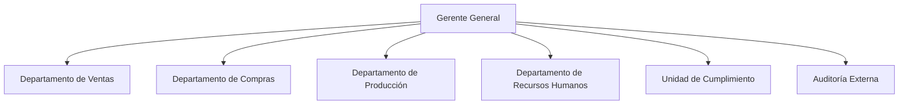

# UES

El objetivo de este repositorio es ser una colección de información.

## ¿Cómo aportar?

Contactame para agregarte al proyecto, o has un fork del repositorio

## Como se debe aportar

En la carpeta colab existen archivos con extensión `.md` y `.yml`, se debe enfocar en los archivos `.md` estos siguen una estructura bastante especifica.

### Formato de archivo

Se debe de asegurar que sea un archivo `.md` y además debe tener un `encoding` UTF-8 y un `End Line Sequence` LF

### Nombre de archivos

Este debe ser explicito con respecto al contenido, además debe ser escrito como `slug`, sino sabes como va un slug supongamos la siguiente página. "Introducción a la Infórmatica" su slug sería "introduccion-a-la-informatica"

... aun faltan más detalles

### Archivos Markdown (.md)

Actualmente se esta utilizando Markdown, por lo que es necesario conocer su sintaxis, [Guia de Markdown](https://tutorialmarkdown.com/guia). Actualmente se soporta la versión extendida, por lo que es posible colocar etiquetas html.

El primer bloque debe ser de la siguiente manera.

```md
---
title: Titulo de la página
description: Descripción de la página
---

```

### Bloques de código

Si quieres mostrar bloques de código es necesario lo haces de la siguiente manera
\```lang
code here
\```

| Nombre | lang |
| --- | --- |
| PHP | php |
| JavaScript | javascript |
| Bash | bash |
| Markdown | markdown |
| Assembly | asm |

### Componentes

Es posible utilizar Componentes, actualmente se tiene la siguiente lista de componentes

#### mermaid

Se utiliza de la siguiente manera
```markdown
<mermaid>
Code here
</mermaid>
```

Es importante resalta que un reglon vacio causa error de sintaxis :)



